# DINOVsis -- radiomics + DINOv3 -> linear Cox head: study summary

This is a task-by-task walkthrough of the whole linear-head study: what was
built, what was found, and the key figure for each step. Full detail and
raw outputs for the validation work live in `save/`; this folder is the
curated narrative version.

## Starting point: the data, and why event scarcity drives everything

- 491 NPC (nasopharyngeal carcinoma) T1 MRI cases with tumor segmentation
  masks (`data/NPC_pre/T1/{image,label}`), but only **371 have outcome
  labels** (`data/labels/Case*.json`) -- the other 120 are imaged but
  unlabeled, unusable for supervised survival modeling.
- Three possible outcomes are available per case, each with its own
  event flag and its own time-to-event column (these differ from each
  other -- a case can die before its recorded recurrence follow-up time,
  so pairing the wrong ones is a real bug, see the nested-CV section):
  `event`/`time_months` (death), `recurrence`/`recurrence_t_months`,
  `metastasis`/`metastasis_t_months`.
- The three outcomes have very different amounts of statistical power
  available, because Cox models are powered by *event count*, not case
  count:

  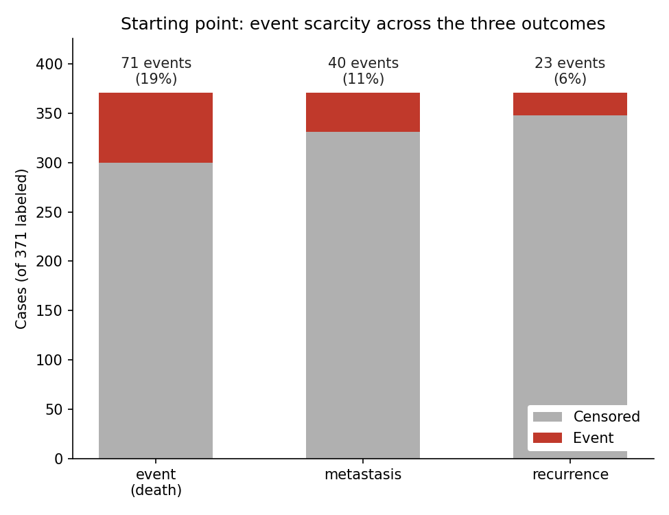

  71 death events, 40 metastasis events, 23 recurrence events -- out of
  the same 371 cases. This one fact explains most of what follows:
  `event` (death) is the only outcome with enough events to reliably
  validate a signal; `recurrence` in particular is close to a hard floor.
- The 371 labeled cases are split `stratified_train.csv` (260) /
  `stratified_valid.csv` (56) / `stratified_test.csv` (55), stratified by
  the `event` (death) label so the death rate is preserved in each split
  (`data/splits/make_splits.py`). A `complete_list.csv` with all 371 cases
  is used later for full-cohort nested CV.

## Task 1 -- Radiomics feature extraction (`data/radiomics/make_radiomics.py`)

pyradiomics, run per case on the T1 volume + tumor mask, fully 3D
(`force2D=False`, confirmed against pyradiomics defaults) -- 107 features
per case (shape, first-order, GLCM/GLDM/GLRLM/GLSZM/NGTDM), cached as
`data/radiomics/Case###.json`.

## Task 2 -- Feature pruning (`src/feature_prunning/prune_features.py`)

107 raw features is too many for a linear Cox head with only ~50-260
events depending on outcome and split. Selection is fit **only on the
train split**, per event_type, in two steps:

1. Score every feature by 5-fold cross-validated univariate Cox
   concordance index (in-sample scoring was tried first and rejected --
   it lets a feature look good purely by fitting noise in 260 cases; the
   CV version scores out-of-fold instead).
2. Hierarchically cluster by `|Spearman correlation|` (cut at 0.85) and
   keep only the best-scoring feature per cluster, capped at 15 features.

No feature clears even an uncorrected p<0.05 individually in this cohort
(min p~0.07), so selection uses **ranking, not significance gating** --
confirmed necessary after the first version returned 0 features. Output:
`src/feature_prunning/<event_type>/selected_features.json` (15 features +
train mean/std for standardization) and `feature_report.csv` (full audit
trail), one folder per outcome.

## Task 3 -- DINOv3 + linear Cox head pipeline (`src/linear_model/`)

- **`caching_features.py`**: each case's 3D volume is reduced to one 2D
  input DINOv3 (a 2D ViT, `dinov3_vits16plus`, local weights) can consume:
  the axial slice with max tumor area, cropped to the tumor bounding box +
  16px margin, percentile-normalized, resized, replicated to 3 channels.
  The DINOv3 CLS token (384-dim) is cached per case
  (`output/cache/image_features_*.npz`), and the pruned/standardized
  radiomics vectors are cached per event_type
  (`output/cache/radiomics_features_<event_type>.csv`) -- nothing
  downstream touches the GPU or raw radiomics again. GPU auto-selected via
  `nvitop` (2x RTX 2080 Ti available).
- **`dataset.py`**: `FeatureStore` loads both caches and builds
  `(X, event, time)` tensors for any case list under
  `input_mode in {radiomics, image, both}` (dims 15 / 384 / 399). Image
  features are standardized using train-split-only statistics, same
  discipline as the radiomics cache.
- **`head_model.py`**: `LinearCoxHead` -- one `nn.Linear(input_dim, 1,
  bias=False)` (no hidden layers, no bias -- the Cox baseline hazard
  absorbs any constant) -- plus `cox_ph_loss`, the Breslow-approximation
  negative log partial likelihood, full-batch (datasets are small enough
  that minibatch risk-set bookkeeping isn't needed). Verified on synthetic
  data with known signal (recovered C-index 0.95).
- **`training.py`**: 5-fold CV on the train split (diagnostic) + a
  separate final model trained on the full train split, early-stopped on
  valid, evaluated once on test. Below: the `event`/`image` run's
  diagnostics --

  | CV concordance (5-fold, train split) | Final model loss curve |
  |---|---|
  | 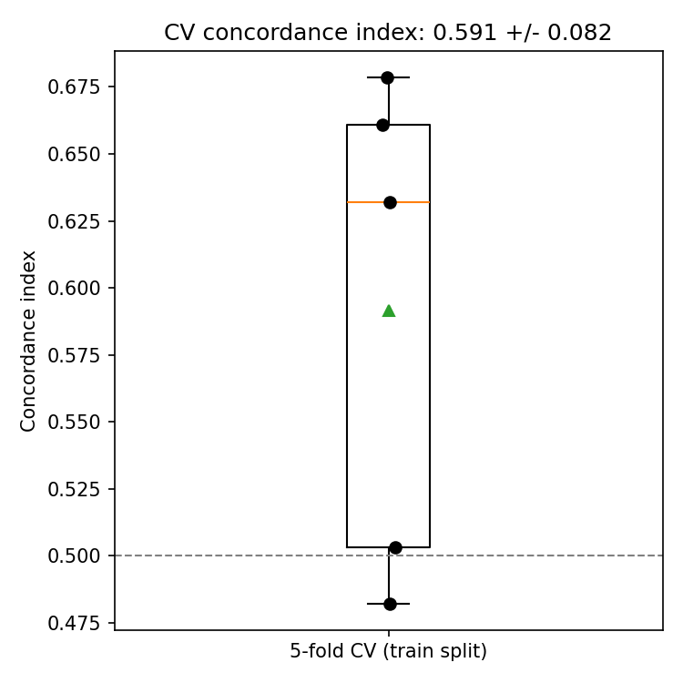 | 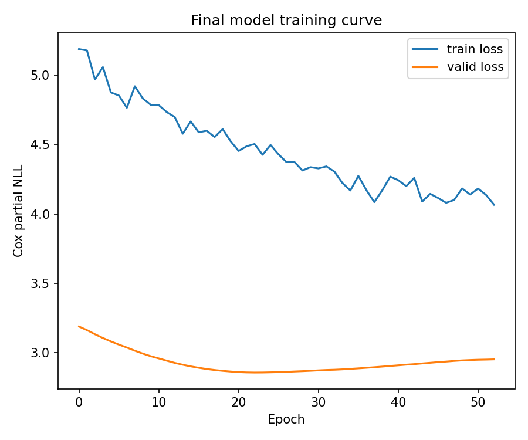 |

  And the clinical-style readout, Kaplan-Meier survival by predicted risk
  group on the test set:

  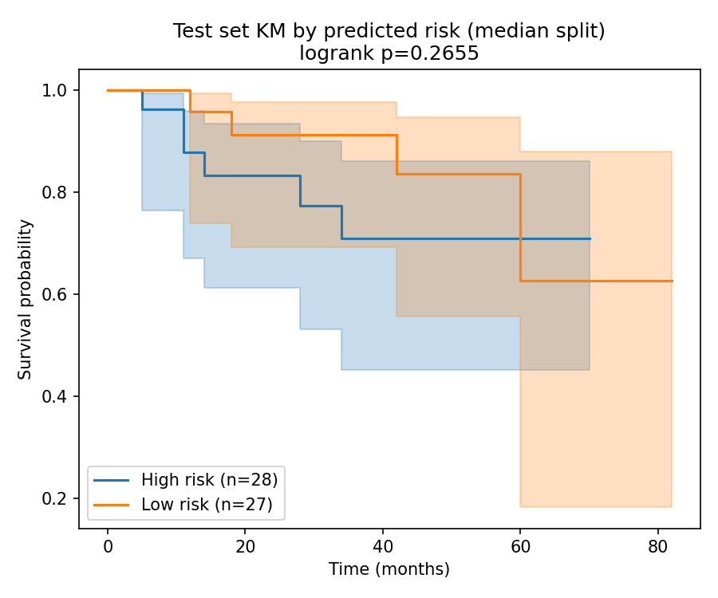

## Task 4 -- Baseline calibration (`src/linear_model/baseline.py`)

The single train/valid/test split alone isn't enough to trust a C-index.
Two baselines were added: a classical single-covariate CoxPH on tumor
volume alone (simplest clinically meaningful floor), and a
**label-permutation null** -- the exact same train/early-stop/test
procedure rerun 200x with (event, time) labels shuffled within each split,
giving an empirical noise floor. Example (`event`/`image`, single split):

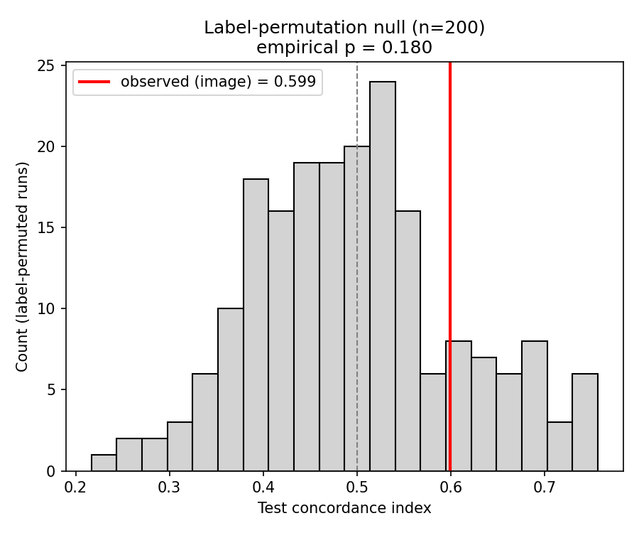

Result at this stage: **nothing cleared significance for any outcome or
input_mode** (all empirical p > 0.15). This is where a real bug was also
caught: `run_volume_baseline` and `FeatureStore` were pairing every
outcome with `time_months` (death time) instead of the matching
event-specific time column -- fixed via a `data.event_time_columns` map in
`config.yaml`, and all recurrence/metastasis numbers were rerun after.

## Task 5 -- Nested cross-validation (`src/linear_model/nested_cv.py`)

A 55-case test set (10 death events) is underpowered to detect a
real-but-modest effect -- "not significant" there can mean "no signal" or
just "not enough test cases." Nested CV resolves the ambiguity: 5 repeats
x 5-fold stratified outer CV over the **full 371-case cohort**
(`complete_list.csv`), inner-train/inner-valid split per outer fold purely
for early stopping, every case gets an out-of-fold risk prediction,
aggregated into one score per case, then scored and null-checked (100
permutations) the same way.

| event / radiomics | event / image | event / both (two-branch) |
|---|---|---|
| 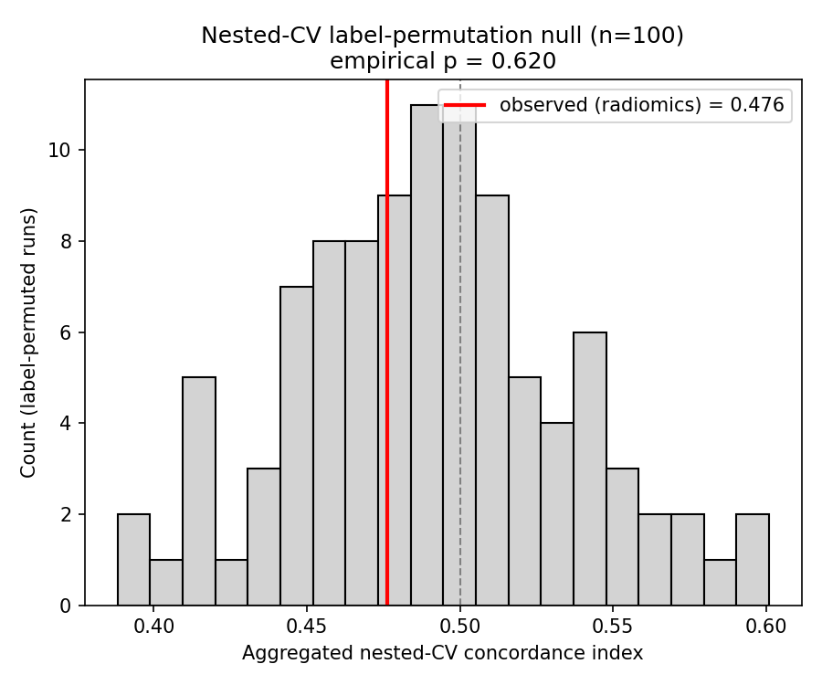 | 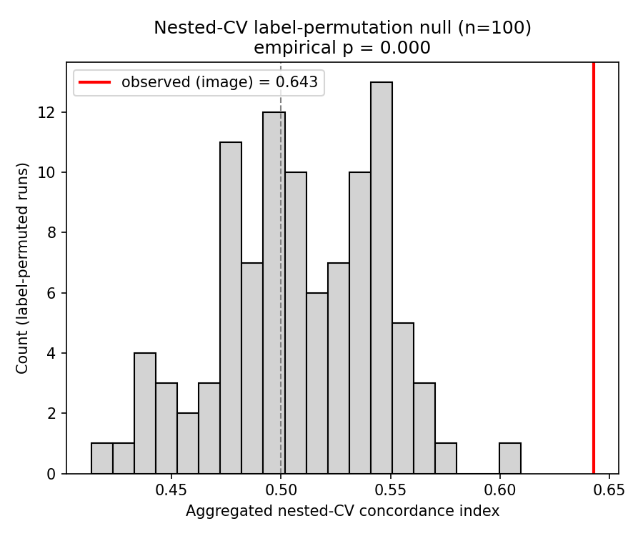 | 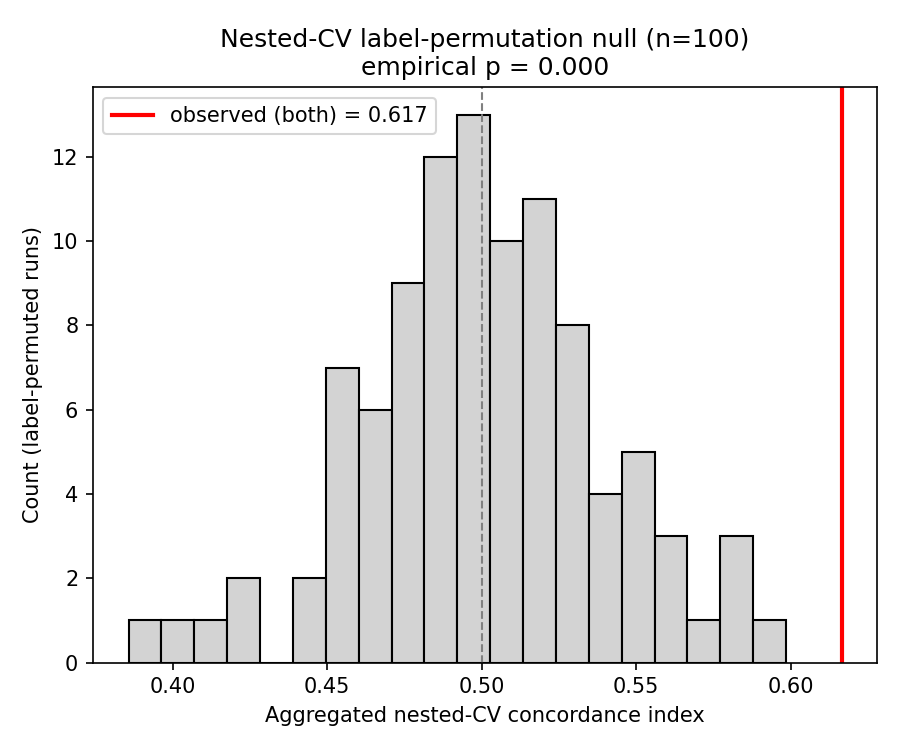 |

| outcome | total events | best mode | nested C-index | empirical p |
|---|---|---|---|---|
| **event (death)** | 71 | **image** | **0.643** | **0.000** |
| metastasis | 40 | image | 0.573 | 0.100 |
| recurrence | 23 | radiomics | 0.563 | 0.200 |

`event`/`image` (and `both`) reversed the earlier "nothing is
significant" conclusion -- p=0.000 means the observed value beat the
*max* of 100 label-permuted null runs, not just the 95th percentile. The
single-split result wasn't wrong, it was underpowered. `metastasis` shows
the same qualitative pattern but far weaker evidence (fewer events).
`recurrence` (right side, radiomics shown as its best mode) still shows
nothing -- with only 23 total events in the whole cohort, this looks like
a genuine data-scarcity floor, not an evaluation-power problem:

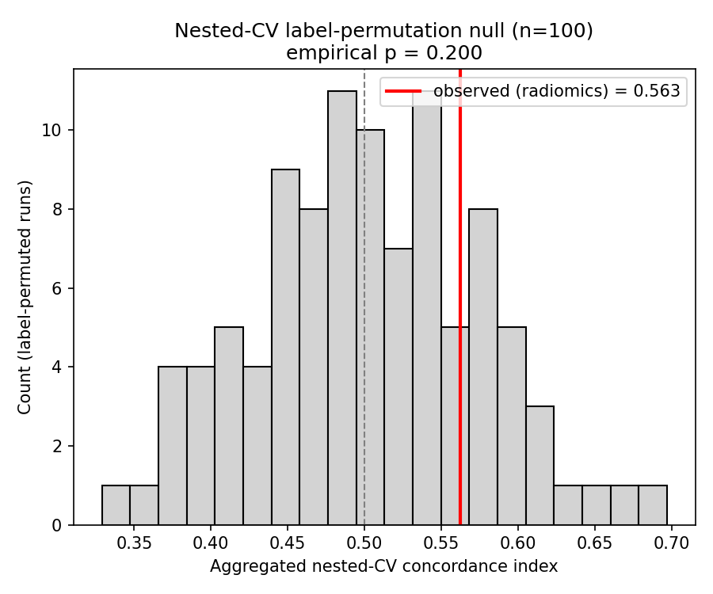

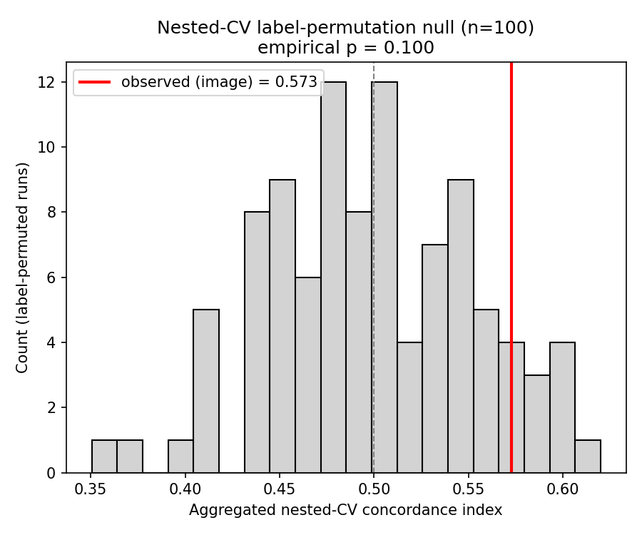

## Task 6 -- Confound check (`src/linear_model/confound_check.py`)

Before trusting the `event`/`image` result as real tumor biology: checked
the aggregated risk score against six technical variables (native crop
size, axial slice position, tumor voxel count, crop intensity) plus tumor
volume, using `radiomics`-mode risk (no established signal) as a "what
does an uninteresting correlation look like" comparison.

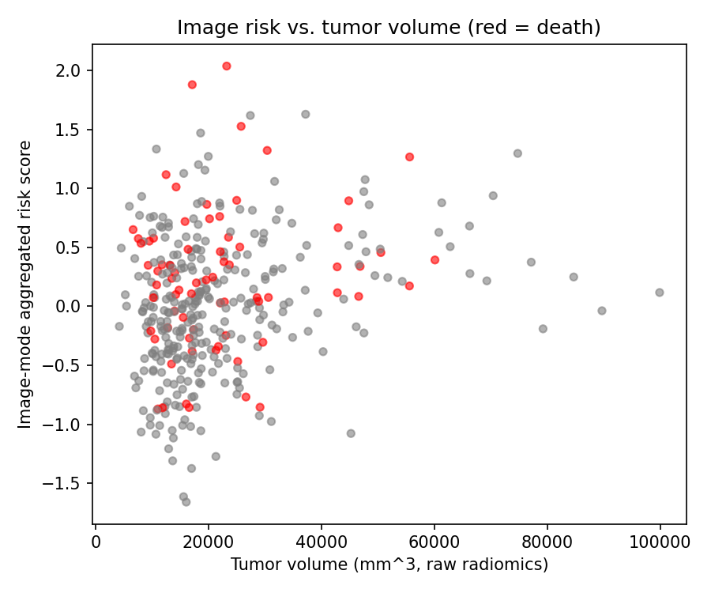

No slice-position artifact (rho~0, p=0.34-0.70). `image` risk correlates
with tumor volume *less* (rho=0.23) than the non-predictive `radiomics`
risk does (rho=0.32) -- the wrong direction for "it's just size in
disguise." The clean result: a bivariate CoxPH with both `image_risk` and
`tumor_volume` shows `image_risk` stays significant (p=0.0006, HR=1.40/SD)
while `tumor_volume`'s own effect collapses to nothing (p=0.999) once
`image_risk` is in the model. One mild, unresolved flag: crop intensity
correlates with the two risk scores in opposite directions, plausibly a
scanner/protocol effect, but there's no acquisition metadata to test that
directly.

## Task 7 -- Fixing `both` mode (`head_model.TwoBranchCoxHead`)

`both` mode (naive concatenation of 399 raw features into one linear
layer) underperformed `image` alone (0.624 vs 0.643 nested C-index) --
hypothesis: 15 non-predictive radiomics dimensions, regularized by the
same global penalty as 384 real-signal image dimensions, add overfitting
risk without benefit. Fix: `TwoBranchCoxHead`, separate linear projections
per modality summed at the output, `radiomics` regularized far more
heavily than `image` (`training.build_model_and_optimizer`).

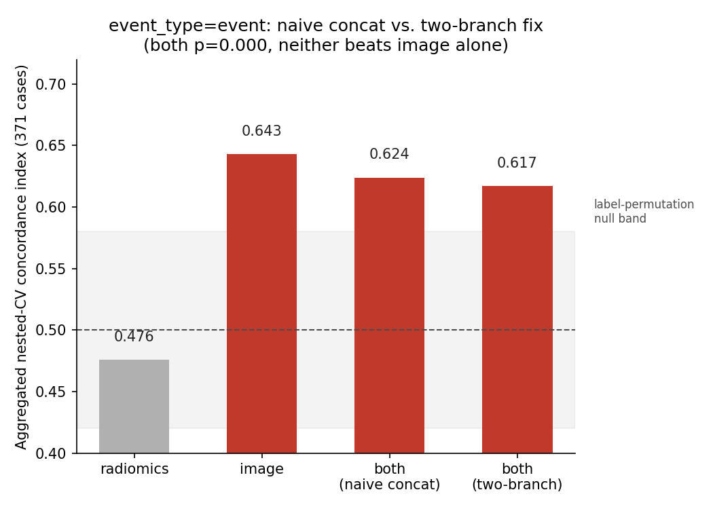

The fix looked like a large win on the single train/valid/test split
(test C-index 0.496 -> 0.629), but under the same nested-CV procedure used
everywhere else, the real number barely moved (0.624 -> 0.617) -- still
below `image` alone, still p=0.000. The single-split jump was mostly
evaluation noise, the same lesson the baseline-vs-nested-CV gap already
taught, now confirmed on this specific architecture change too.

## Task 8 -- Seed stability check

Two results this session (the metastasis time-column bug, the both-mode
single-split jump) looked real on one evaluation and turned out to be
mostly noise on closer inspection. Before fully trusting the flagship
0.643, checked whether it depends on which fold assignment the 5x5-fold
outer CV happened to draw: reran the real (non-permuted) nested-CV pass
for `event`/`image` across 5 different seeds.

Mean 0.622, std 0.014, range [0.595, 0.636] -- tight relative to the
~0.12 effect size above chance. The originally reported 0.643 sits right
at the top of this band, consistent with (not an outlier from) the other
seeds. Unlike the two prior false leads, this result holds up under a
stability re-check.

## Task 9 -- Interpretability (`src/linear_model/interpretability.py`)

The confound check ruled out specific technical shortcuts but didn't show
*what* the model responds to. DINOv3's final-layer patch tokens live in
the same normalized space as the CLS token the linear head was trained
on, so projecting each (train-standardized) patch token onto the trained
weight vector gives a per-patch "risk contribution" map, no backprop
needed. Examples: the model's own most-confident predictions in each
direction (3 cases that died with the highest predicted risk, 3 cases
censored past 30 months with the lowest).

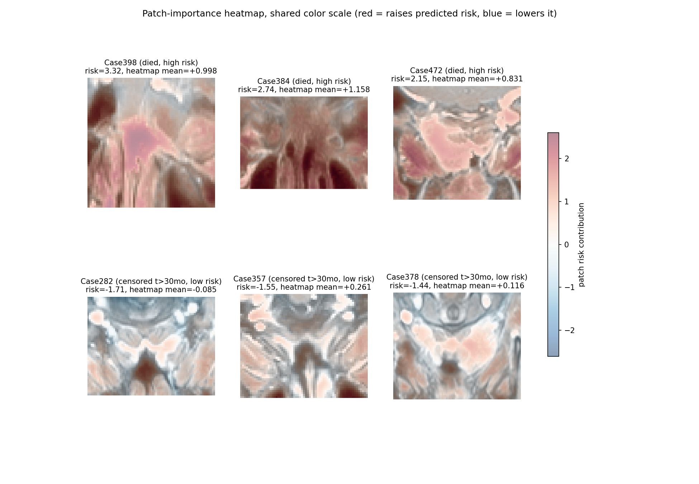

Uses one shared color scale across all 6 examples -- per-image
normalization was tried first and contrast-stretched every case to look
equally "hot" in its own range, hiding the real effect (the same kind of
artifact this whole session kept catching elsewhere, corrected in-place
here too). With a shared scale: high-risk/died cases are overwhelmingly
warm-toned across nearly the whole crop (heatmap mean +0.83 to +1.16);
low-risk/censored cases are much lighter and mixed (-0.09 to +0.26). The
signal is **diffuse across the whole ROI, not localized to a specific
sub-region** -- more of an overall tissue-appearance/texture signature
than a single spotted lesion feature. Illustrative on 6 hand-picked cases,
not a systematic validation.

## Task 10 -- Fine-tuning attempt (`src/linear_model/finetune.py`)

Biggest untried lever: DINOv3 was fully frozen and off-domain throughout.
Unfroze the last transformer block (~8% of backbone params) + final norm,
trained jointly with the head. Scoped down for tractability: image mode
only, single split (not full nested CV), `img_size=224` (DINOv3's native
pretraining resolution, cheaper than 768).

First pass, 5 seeds: test C-index 0.650-0.677 (mean 0.666) -- clearly
above the reference frozen baseline read from `config.yaml`/the cache at
the time (0.588, labeled "768px"), looked like a real win. A
frozen-@-224 control (same code, zero backbone params trainable) was
added to isolate "frozen vs. fine-tuned" from "resolution changed too":

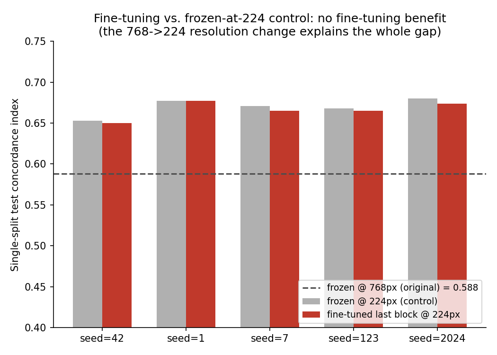

Fine-tuning itself added nothing measurable -- the frozen-@-224 control
(mean 0.670) and the fine-tuned result (mean 0.666) were statistically
indistinguishable, so the gain over 0.588 looked like a pure resolution
effect (768 -> 224).

**Correction (found later, while acting on this finding -- see
`resume/transformer/README.md` Task 3 equivalent work): that "768px"
label was wrong.** `config.yaml`'s `img_size` field had drifted to 768
via later edits, but `caching_features.py` was never rerun after those
edits -- the actual cached embeddings behind *every* validated number in
this study, including the flagship 0.643, had been sitting at
**img_size=224 the entire time**. Verified directly: a freshly, genuinely
regenerated 768px cache scores 0.475 (worse than chance) through the
standard pipeline, while a freshly regenerated 224px cache reproduces
0.588 exactly, confirming the original cache really was 224px all along.
So the "0.588 vs 0.670" gap analyzed above was never a resolution
comparison at all -- both sides were already 224px, just read through two
different code paths (`dataset.py`'s standardized `FeatureStore` cache
vs. `finetune.py`'s own unstandardized on-the-fly loader). The real
source of that ~0.08 gap is most likely the missing standardization step
in `finetune.py`'s data path, not resolution -- not chased further here,
since the finding that actually mattered (224 vs. 768, measured
correctly) is now resolved: **224 was already what every result in this
study used**, and it's genuinely the better choice (confirmed by the
freshly-regenerated 768px test above). There was no unrealized gain
waiting to be captured -- just a stale config value that never described
what was actually cached.

## Task 11 -- Swapping the backbone: Merlin (3D CT foundation model)

Everything above uses DINOv3 (a 2D natural-image ViT) fed a single
tumor-cropped axial slice. The obvious question: does a **3D medical
foundation model** given the *whole volume* do better? Ported the entire
linear-head pipeline to **Merlin** (`stanfordmimi/Merlin`, an I3D
ResNet-152 CT tower) in `src/linear_model_Merlin/` -- head, dataset,
training, nested-CV code copied verbatim (all backbone-agnostic), only
`load_backbone.py` + `caching_features.py` rewritten. Each case's full 3D
CT volume goes through Merlin's native MONAI transforms (RAS,
1.5x1.5x3 mm, HU window -1000..1000, 224x224x160) to one **2048-d**
whole-volume embedding, cached exactly like the DINOv3 features and run
through the identical head. Ran in the `MERLIN` conda env.

**The single-split result looked competitive -- and was a trap.** On the
one stratified train/valid/test split, Merlin `image` mode scored test
C-index **0.620** (vs DINOv3's single-split ~0.62 region), which would
read as "roughly on par with DINOv3." But the whole point of this study
is that single-split numbers lie, so the same **5x5 nested-CV +
100-permutation null** used for the flagship result was run over the full
371-case cohort:

| backbone / mode | single-split test C | **nested-CV C** | nested p |
|---|---|---|---|
| DINOv3 / image (flagship) | ~0.62 | **0.643** | **0.000** |
| **Merlin / image** | 0.620 | **0.489** | 0.58 |
| Merlin / radiomics | 0.484 | 0.476 | 0.62 |
| Merlin / both (two-branch) | 0.424 | 0.455 | 0.83 |

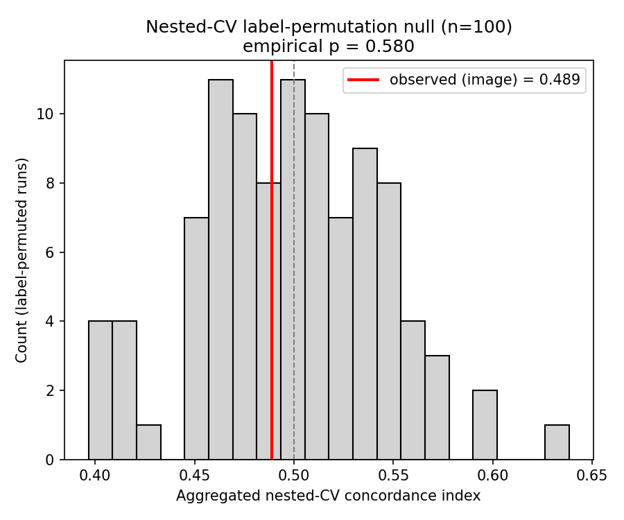

**Merlin's whole-volume embedding carries no validated survival signal for
NPC death (0.489, p=0.58 -- squarely inside the null band).** The 0.620
single-split was pure noise, the exact failure mode this study kept
catching; under honest evaluation Merlin sits at chance while DINOv3 holds
0.643. The most likely reason is *localization*, not modality or "2D vs
3D": DINOv3 is handed a **tumor-cropped** slice (the pruning/crop pipeline
points it straight at the lesion), whereas Merlin pools the entire
head-and-neck volume into one global vector with no tumor guidance -- and
it was pretrained on **abdominal** CT, an anatomical domain shift on top.
A global "whole-scan appearance" embedding apparently doesn't preserve the
tumor-texture signal the cropped-slice DINOv3 head feeds on. Radiomics and
`both` stay at chance here too, consistent with every other evaluation in
this study.

Takeaway: a bigger, 3D, in-modality foundation model is **not**
automatically better -- how the region of interest is presented to the
backbone matters more than the backbone's size or dimensionality.

### Follow-up: giving Merlin the same tumor ROI crop as DINOv3

The obvious test of the localization hypothesis: stop feeding Merlin the
whole volume and instead crop to the tumor. `config/config_merlin_roi.yaml`
crops each case to the mask's **3D bounding box + margin** and resizes it
to fill Merlin's 224x224x160 input -- the 3D analog of DINOv3's
tumor-cropped-then-resized axial slice. Intensity (HU window) and spacing
stay exactly as Merlin's native pipeline, so **ROI-vs-whole-volume is the
only thing that changes**. Re-cached, re-ran the identical nested CV:

| Merlin / mode | whole-volume nested-CV | **ROI-crop nested-CV** | ROI p |
|---|---|---|---|
| image (simple) | 0.489 | **0.528** | 0.24 |
| both (two-branch) | 0.455 | **0.513** | 0.36 |
| radiomics | 0.476 | 0.476 (shared) | 0.62 |

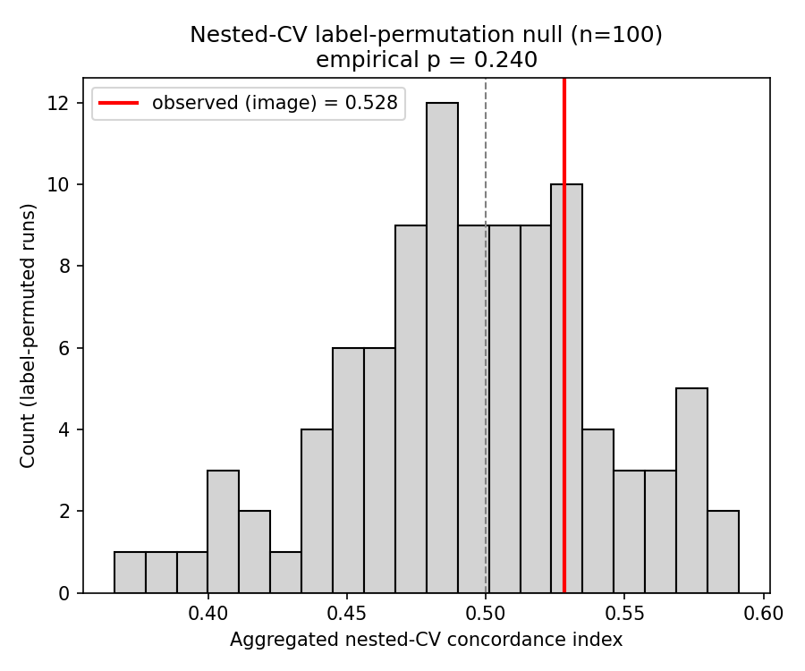

The ROI crop moves the image branch in the **right direction** (0.489 ->
0.528) and `both` with it (0.455 -> 0.513) -- localization *does* matter,
as hypothesized. But **both stay inside the null band** (p=0.24 / 0.36):
still not a validated signal, and still a wide gap below DINOv3's 0.643.
So localization was part of the story but not the whole answer. Even with
the tumor cropped and zoomed to fill the field, Merlin's whole-volume
average-pooled embedding (I3D ResNet trained on abdominal CT) doesn't
expose the prognostic tumor-texture signal that DINOv3's cropped-slice CLS
token does. The remaining suspects, not separated here: the abdominal->
head/neck domain shift, and global average-pooling washing out the
fine-grained texture a patch/CLS representation preserves. Using Merlin's
512-d contrastive image head instead of the raw 2048-d avgpool, or a
head/neck-pretrained 3D backbone, would be the next things to try.

## Task 12 -- Multi-slice tumor aggregation (does one slice waste signal?)

The whole pipeline feeds DINOv3 a **single** slice per case: the one axial
slice with the largest tumor area (`best_slice_roi`). But the Task 9
interpretability pass found the risk signal is **diffuse across the whole
tumor ROI**, which raises an obvious worry -- are the other tumor-bearing
slices carrying signal we throw away? Tested it directly by extracting
DINOv3 CLS tokens for **every** tumor slice of every case
(`src/linear_model_multislice/`, 2133 slices, mean 5.7/case) and
aggregating them three ways, each scored with the identical 5x5 nested-CV:

1. **top-k mean** -- average the k largest-tumor-area slices (k = 3/5/7)
2. **all-slices mean** -- average every tumor slice
3. **attention pool** -- a gated-attention MIL head learns per-slice
   weights and pools, so informative slices can dominate (image only)

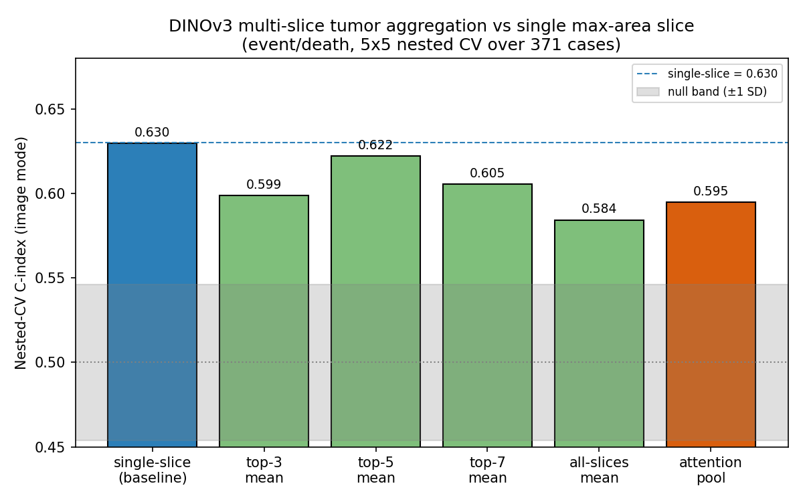

| aggregation | image C | both C |
|---|---|---|
| **single max-area slice (baseline)** | **0.630** | **0.641** |
| top-3 mean | 0.599 | 0.591 |
| top-5 mean | 0.622 | 0.580 |
| top-7 mean | 0.605 | 0.588 |
| all-slices mean | 0.584 | 0.577 |
| attention pool (image) | 0.595 (p=0.033) | -- |

(The single-slice baseline re-ran at 0.630 here, not the flagship 0.643 --
consistent with the seed band 0.622 +/- 0.014 from Task 8; the whole point
of re-running it in the same batch was an apples-to-apples reference, and
0.630 confirms nothing drifted.)

**Clean negative result: no aggregation beats the single slice, and
mean-pooling monotonically hurts** the more slices it averages in
(0.630 -> 0.622 -> 0.605 -> 0.584 as k grows to "all"). The single
max-tumor-area slice is the most informative one; averaging drags in
lower-signal peripheral slices and dilutes it. The attention head
(0.595) -- which *could* have learned to up-weight the good slices --
doesn't rescue it either: on only 71 events the extra attention
parameters overfit more than the slice-weighting flexibility helps. All
variants stay a real signal (p <= 0.033), just none better than one slice.

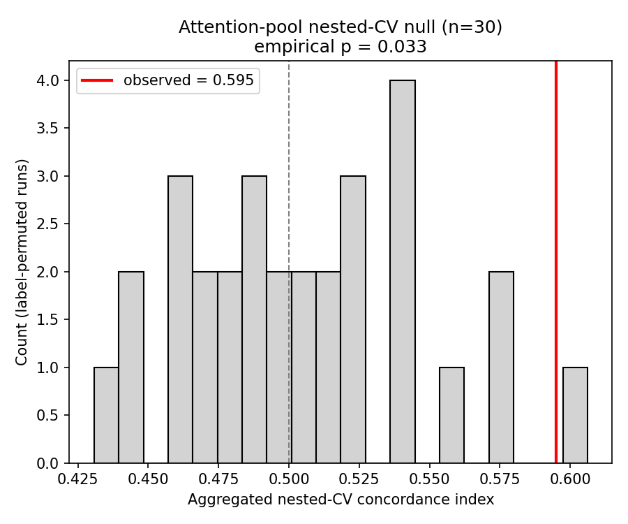

Takeaway: the single-slice design wasn't leaving signal on the table --
the diffuse-within-ROI signal the interpretability pass saw is already
captured by the max-area slice, and neighbouring slices are largely
redundant-or-worse. This closes the "use more slices" lever; it's the
representation/backbone and event count that bound performance, not the
number of slices fed in.

## Task 13 -- Backbone benchmark: does any other foundation model beat DINOv3?

Merlin (Task 11) was one alternative backbone; this task widens it into a
systematic sweep. Every model embeds the **same** tumor-cropped max-area
slice DINOv3 gets (through its own native image processor, so each sees its
pretraining input distribution), frozen, then the identical linear Cox head
+ 5x5 nested CV. Harness: `src/backbone_benchmark/extract_2d.py` (one
embedding cache per model, dropped into the existing pipeline via a
generated config). This closes the "maybe a different encoder just works
better" question with numbers instead of intuition.

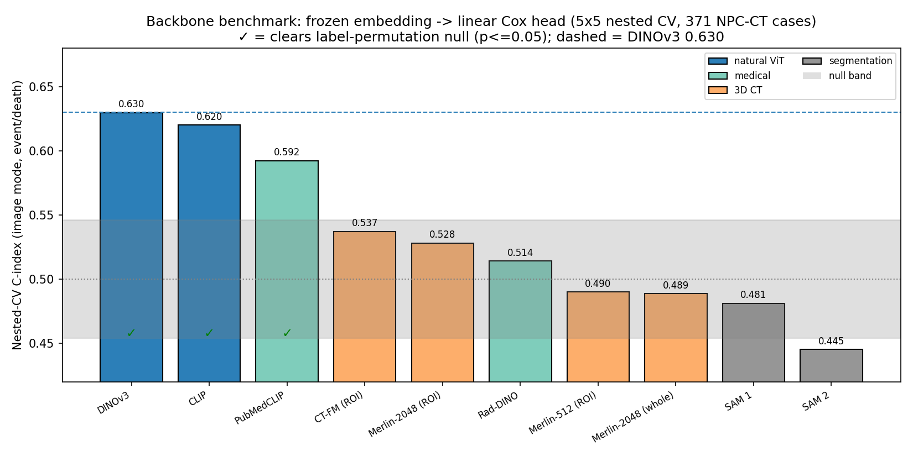

The 2D models embed the tumor-cropped max-area slice; the 3D CT models
(Merlin, CT-FM) embed the tumor-ROI 3D crop (their native modality).

| backbone | dim | pretraining | training objective | image C | both C |
|---|---|---|---|---|---|
| **DINOv3** (reference) | 2D | natural (LVD-1689M) | self-distillation | **0.630** | 0.641 |
| **CLIP** | 2D | natural (WIT-400M) | image-text contrastive | 0.620 | 0.601 |
| **PubMedCLIP** (MedCLIP slot) | 2D | medical (ROCO) | image-text contrastive | 0.592 | 0.584 |
| CT-FM (ROI) | 3D | CT (~148k vols) | self-supervised | 0.537 (p=0.21) | 0.510 |
| Merlin-2048 (ROI) | 3D | abdominal CT-text | image-text contrastive | 0.528 (p=0.24) | 0.513 |
| Rad-DINO | 2D | medical (chest CT/X-ray) | self-distillation | 0.514 (p=0.38) | 0.475 |
| Merlin-512 contrastive (ROI) | 3D | abdominal CT-text | image-text contrastive | 0.490 (p=0.54) | 0.486 |
| Merlin-2048 (whole volume) | 3D | abdominal CT-text | image-text contrastive | 0.489 (p=0.58) | 0.455 |
| SAM 1 | 2D | natural (SA-1B) | promptable segmentation | 0.481 (p=0.70) | 0.502 |
| SAM 2 | 2D | natural (SA-V) | promptable segmentation | 0.445 (p=0.86) | 0.465 |

(image-mode C; **only DINOv3 / CLIP / PubMedCLIP clear the null** at
p <= 0.02 -- everything else, including every CT-specific 3D model, sits
inside it. True MedCLIP weights aren't openly downloadable, so PubMedCLIP
-- an accessible medical CLIP -- stands in for that slot; SAM 3 is gated
and still pending access.)

**Three results that overturn the obvious intuition:**

1. **"Medical-domain pretraining" did not help.** The medical 2D models are
   the *worse* of the classification/contrastive group -- PubMedCLIP
   (0.592) trails natural CLIP (0.620), and Rad-DINO (0.514) is at chance
   despite being the direct medical analog of the winning DINOv3. Rad-DINO
   was pretrained on **chest** imaging; head/neck NPC is out of its domain,
   and that domain mismatch hurts more than generic natural-image features.

2. **CT-specific 3D foundation models also fail to clear the null.** CT-FM
   (0.537) and Merlin (best 0.528, ROI-cropped) are the strongest of the
   non-significant group but never reach significance (p=0.21 / 0.24), and
   sit ~0.10 below DINOv3. In-modality (native CT) and 3D did *not* beat a
   2D natural-image ViT fed a single cropped slice. Merlin's 512-d
   image-text contrastive head (0.490) is no better than its 2048-d
   avgpool -- so "avgpool washes out texture" wasn't the problem either;
   the representation just doesn't encode this signal.

3. **The training *objective* matters more than the domain, modality, or
   architecture.** Everything that clears the null is a
   classification/contrastive ViT (DINOv3, CLIP, PubMedCLIP). Everything
   that fails is either **segmentation**-pretrained (SAM 1/2 -- features
   encode "where are the boundaries," not global tumor texture), or a
   dense/CT self-supervised encoder (Merlin, CT-FM) whose global-pooled
   features don't carry it. Bigger/newer doesn't rescue it (SAM 2 < SAM 1).

Bottom line of the sweep: **DINOv3 is essentially tied with natural-image
CLIP at the top, and nothing tested -- medical, CT-native, 3D, or
segmentation -- beats it or even matches it with significance.** The
signal is carried by generic natural-image self-supervised/contrastive
features on a tumor-cropped slice; domain, modality-match, 3D, and
segmentation priors all fail to transfer. (Only the gated **SAM 3**
remains to be added, pending access.)

## Task 14 -- Fusing the two winners: DINOv3 + CLIP

The benchmark left one lead worth chasing: DINOv3 (0.630) and CLIP (0.620)
both carry signal from *completely different* pretraining, the classic
setup for complementarity. Concatenated their frozen embeddings
(384 + 512 = 896-d, each train-standardized) into the same linear Cox head.

A single nested-CV run (seed 42) scored **0.669** -- a +0.04 jump over
DINOv3 alone and above the flagship 0.643. But this study has been burned
repeatedly by single-run jumps, so it got the Task-8 treatment: rerun the
real nested-CV across 7 seeds, and -- because comparing noisy means is
weak -- **pair it against DINOv3 alone on the same seeds**.

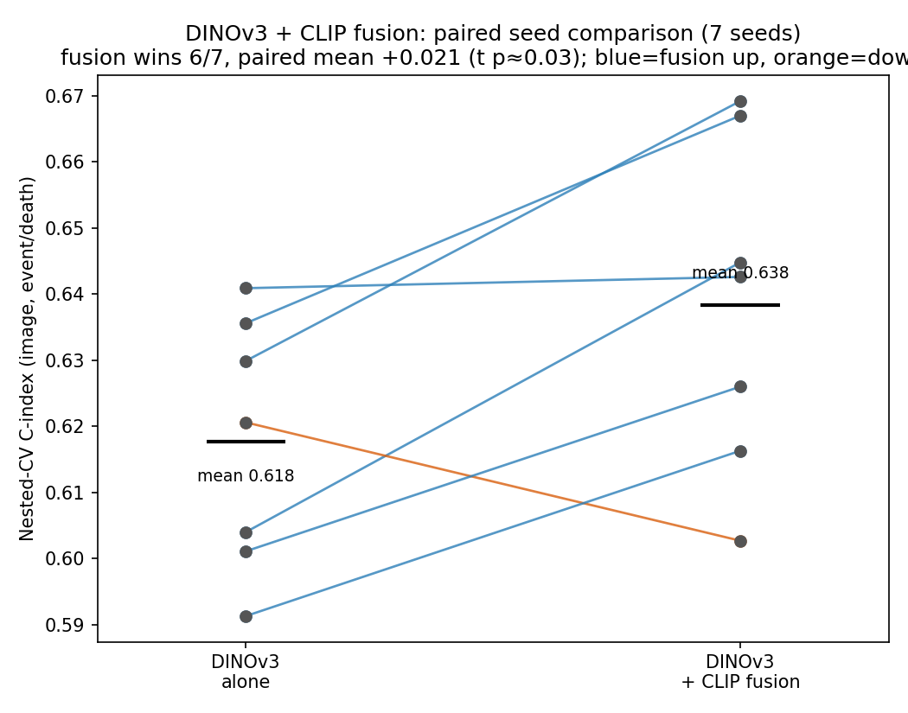

| | mean C | std | vs DINOv3 (paired) |
|---|---|---|---|
| DINOv3 alone | 0.618 | 0.018 | -- |
| **DINOv3 + CLIP** | **0.638** | 0.023 | **+0.021, wins 6/7 seeds** |

**Verdict: the 0.669 was a lucky seed (top of the band), but fusion is a
small, genuine, reproducible gain.** Paired, it beats DINOv3 alone on 6 of
7 seeds by +0.021 on average (paired-t p~0.03) -- so the real story is
~0.62 -> ~0.64, not ~0.63 -> ~0.67. The two natural-image ViTs are
modestly complementary; fusion also adds variance (std 0.023 vs 0.018), a
mild overfitting cost of the extra 512 dims on 71 events. Worth keeping as
the best-performing configuration, but the honest headline is "a couple of
points, not a breakthrough" -- and it should be locked-box validated
before being reported as a final number. This is the fourth+ time a
single-run improvement shrank under a stability/paired re-check; the
pattern is now the study's most reliable finding about its own method.

## Bottom line

- **`event` (death) + `image` mode is a real, validated, confound-checked,
  seed-stable signal**: nested C-index 0.643 (stable at 0.622 +/- 0.014
  across seeds), p=0.000, survives a bivariate check against tumor
  volume. This is the one number in this study you can currently trust,
  and it's held up under every re-check thrown at it.
- The signal looks diffuse across the tumor crop rather than localized to
  one sub-region -- more a texture/appearance signature than a single
  spotted feature, per the interpretability pass.
- **Fusing DINOv3 + CLIP** (the two natural-image winners) is the best
  configuration found: paired across 7 seeds it beats DINOv3 alone on 6/7
  by +0.021 (mean 0.638 vs 0.618, paired-t p~0.03). Real but modest -- the
  eye-catching single-run 0.669 was seed luck. Keep it as the top model;
  don't report 0.669 as the number.
- A **9-model backbone sweep** (Rad-DINO, CLIP, PubMedCLIP, SAM 1/2, plus
  3D CT: Merlin whole-vol / ROI / 512-contrastive, CT-FM) finds **nothing
  beats DINOv3, and only natural-image CLIP even matches it with
  significance** (0.620). Medical (PubMedCLIP 0.592, Rad-DINO chance),
  CT-native 3D (CT-FM 0.537, Merlin best 0.528 -- both p>0.2), and
  segmentation (SAM, chance) backbones all fail to clear the null. The
  signal wants a classification/contrastive natural-image ViT on a
  tumor-cropped slice; medical domain, CT modality, 3D, and segmentation
  priors don't transfer. (Only gated SAM 3 still pending.)
- Feeding DINOv3 **more tumor slices does not help**: top-k mean, all-slice
  mean, and a learned attention-pool head all score at or below the single
  max-area slice (0.630), and mean-pooling gets monotonically worse the
  more slices it averages (down to 0.584 for all-slices). The single-slice
  design isn't wasting signal -- neighbouring slices are redundant-or-worse
  and averaging dilutes the best one. Performance is bounded by the
  representation and the 71 events, not the slice count.
- `radiomics` alone carries no validated signal for any outcome, under any
  evaluation scheme or combination architecture tried.
- `metastasis` is a plausible but unconfirmed lead (p=0.10) -- likely
  needs more metastasis-labeled cases to resolve, not more evaluation
  cleverness.
- `recurrence` is a genuine data-scarcity dead end at 23 total events.
- Fine-tuning the last DINOv3 block added nothing measurable. The
  resolution question this initially raised turned out to be moot: the
  cached embeddings behind every result in this study were already
  img_size=224 (a stale `config.yaml` value had made it look like 768);
  confirmed by direct comparison that 224 genuinely beats a real 768px
  run (0.588 vs. 0.475 single-split), so nothing was left on the table
  here -- the better resolution was already in use throughout.
- The nested-CV number for `event` uses every labeled case in some
  evaluation role -- there is no untouched data left to report a clean,
  unbiased final test number for that outcome. Treat 0.643 as strong
  evidence the signal is real, not as a number to publish as final
  performance.
- Swapping the DINOv3 tumor-cropped-slice backbone for the **Merlin** 3D CT
  foundation model on the *whole volume* did **not** help: Merlin `image`
  scores nested-CV 0.489 (p=0.58, chance) despite a deceptive 0.620
  single-split. Giving Merlin the **same tumor ROI crop** as DINOv3 lifts
  it partway (0.489 -> 0.528 image, 0.455 -> 0.513 two-branch) but still
  leaves it inside the null band (p=0.24) and far below DINOv3's 0.643 --
  so ROI localization matters but doesn't close the gap; the Merlin
  whole-volume avgpool embedding (abdominal-CT-pretrained) just doesn't
  carry this tumor-texture signal. Backbone + ROI presentation dominate;
  fusion machinery is secondary.
