# Hybrid ViT-Cox (paper architecture) -- study summary

Reproducing the architecture from *Radiomics-Guided Vision Transformers
for Survival Analysis* (2604.21056v1.pdf, Fig. 4, p.15) on our own NPC
cohort, with the image encoder swapped for DINOv3. This is the sequel to
`resume/linear_head/` -- read that first for the data/event-scarcity
context and the radiomics pruning pipeline this work builds on.

## The architecture (paper Fig. 4, p.15, adapted)

Two branches feeding a mixed Cox risk, aligned by a contrastive loss:

- **Image branch**: in the paper, a 12-block pixel ViT trained from
  scratch. Here: **DINOv3's CLS token**, fully frozen -- reused directly
  from the cached embeddings built in the linear-head study, never
  loaded into this model's compute graph at all.
- **Radiomics branch**: a shallow **1-block transformer** ("Radiomics
  Encoder" in the paper). Each tumor crop is divided into a 6x6 grid of
  32x32 patches; each patch gets its own full pyradiomics feature vector
  (patch itself = the ROI, all-ones mask). The token sequence + a
  learnable CLS token + learned position embeddings feed one
  pre-norm transformer block; the output CLS token is the radiomics
  representation.
- **Fusion**: `r_img = beta . phi(CLS_img)`, `r_rad = gamma . phi(CLS_rad)`
  (phi = ReLU), mixed risk `F = (1-alpha) r_img + alpha r_rad` (eq. 3,
  alpha=0.5). Separate small projection heads map each branch's CLS token
  into a shared 64-dim space for an NT-Xent contrastive loss that aligns
  the two modalities. Total loss: `(1-lambda) L_Cox + lambda L_CL`.

**What's frozen vs. trained** (a question worth being precise about,
since "pretrained" and "frozen" got used loosely at first):

| component | status |
|---|---|
| DINOv3 backbone | frozen, not even loaded -- only its cached output is used |
| Radiomics shallow transformer | pretrained on an external dataset, then **fully fine-tuned** (nothing frozen) during NPC training |
| beta, gamma, both projection heads | new, trained from scratch on NPC, no pretraining |

Extension beyond the paper: the paper always trains the radiomics branch
jointly with Cox+contrastive loss on the *same* final dataset. We instead
**pretrain** it first via masked-token reconstruction (BERT/MAE-style: mask
~40% of patch tokens, reconstruct them from context) on a large external
CT/MRI corpus with no survival labels, then use that as the fine-tuning
starting point -- since a shallow transformer trained from scratch on
only ~260 NPC cases has very little data to learn a token representation
from otherwise.

## Task 1 -- Pipeline (`src/ViT_cox/`)

- `radiomics_tokenizer.py`: shared patch-grid tokenizer (6x6 grid, 32x32
  patches, full 107-feature pyradiomics per patch). Runs in the
  `radiomics` conda env (no torch) so it works for both pretraining-corpus
  prep and NPC tokenization.
- `radiomics_transformer.py`: the shallow encoder + `MaskedRadiomicsPretrainer`.
- `hybrid_model.py`: `HybridViTCox` (both branches + fusion) and the
  NT-Xent loss.
- `prepare_luna16.py`, `prepare_npc_mri_pretrain.py`, `prepare_npc_tokens.py`:
  data prep for the two pretraining corpora tried and for our own cohort.
- `pretrain_radiomics.py`, `train.py`, `nested_cv.py`: masked-token
  pretraining, single-split fine-tuning, and full nested-CV validation.

Two real bugs were caught and fixed while building this:
1. **Mismatched feature dims across splits** -- standardization stats
   were being fit separately per split instead of once on train.
2. **Float32 precision artifact**: `.std()` on the raw (9360, 107)
   feature array, computed in float32, made ~30 genuinely-constant
   columns look like they had signal (45 "kept" vs. the correct 16) --
   fixed by computing all standardization statistics in float64.

## Task 2 -- Pretraining corpus #1: LUNA16 (lung CT)

First attempt used **LUNA16** (public lung-nodule CT benchmark), since it
was readily available and "of your choice." 3 subsets downloaded,
tokenized, and immediately deleted after each (disk was down to 32GB
free) -- **368 nodule crops**, 93/107 features kept after the
zero-variance filter.

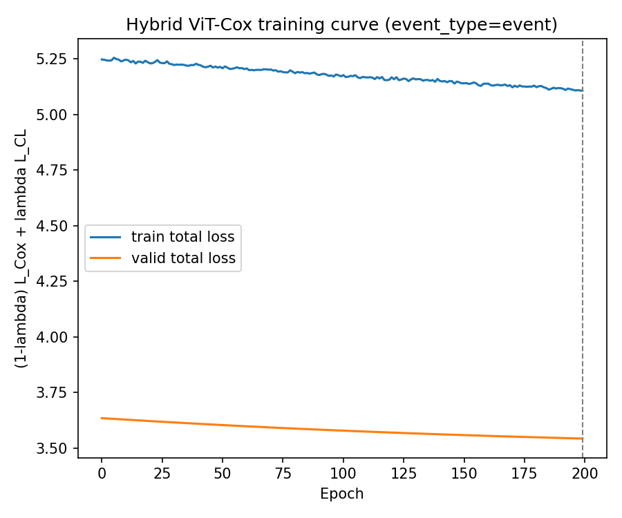

*(LUNA16's own pretraining loss curve was later overwritten when the
corpus was swapped -- numbers: train MSE 1.36 -> 0.63 over 100 epochs,
val noisy but trending down, similar shape to the NPC-MRI curve below.
The image above is the single-split fine-tuning loss curve using the
LUNA16-pretrained radiomics branch.)*

**Single-split smoke test** (fast sanity check before the expensive
nested-CV run): test C-index **0.588**.

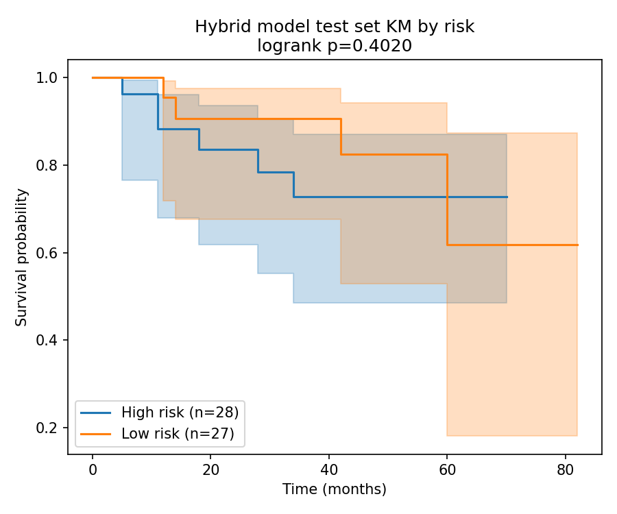

## Task 3 -- Nested-CV validation (LUNA16 pretrain)

Same protocol that validated the linear-head study's flagship result:
5x5-fold stratified outer CV over the full 371-case cohort, 30-permutation
label-shuffled null (fewer than the linear head's 100 -- each hybrid
training run is far more expensive: full transformer + contrastive loss
vs. one linear layer, ~52 min total for this run).

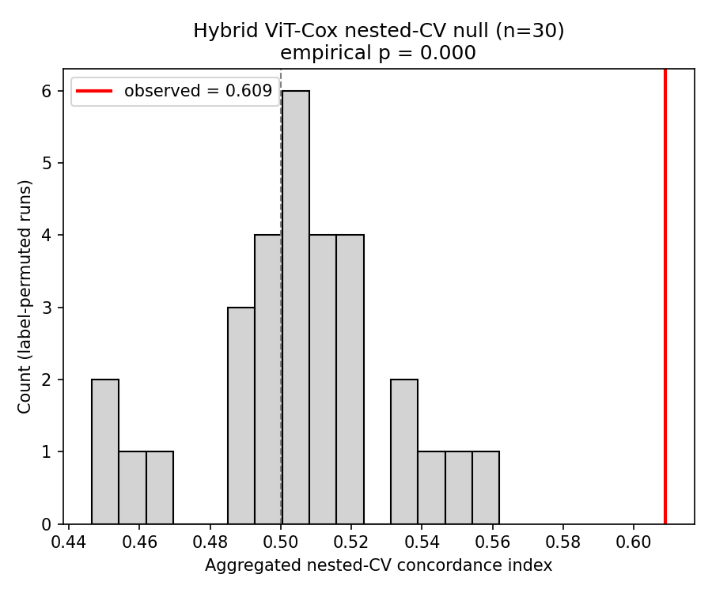

**Result: C-index 0.609, null mean 0.505 +/- 0.026, p=0.000** -- a real,
significant signal, clearly outside the null band.

## Digression -- what's frozen/trained, and the test-set question

Mid-study, walked through exactly what's frozen/pretrained/new (table
above) and a methodology question worth flagging explicitly: **nested CV
rotates every one of the 371 patients through the test role at some
point** -- there is no fixed, disjoint group held out once and never
touched. This is valid for answering "is there a real signal" (the
label-permutation null goes through the identical procedure, so it's a
fair comparison even if the pipeline has some overfitting tendency), but
it does **not** give a clean, unbiased performance number for one final
deployable model, and every architecture/hyperparameter choice in this
study was shaped by iteratively looking at nested-CV results on this same
fixed cohort. Recommended (not yet acted on): carve out a genuine lockbox
test set and never touch it in any further tuning, for a true final
number once the pipeline design is frozen.

## Task 4 -- lambda_loss sweep

The paper's own Table 7 discussion (p.16) found performance "most
sensitive to lambda_loss, with smaller values generally yielding better
test C-index." Swept lambda in {0.0, 0.1, 0.2, 0.3, 0.5} on the fast
single-split check.

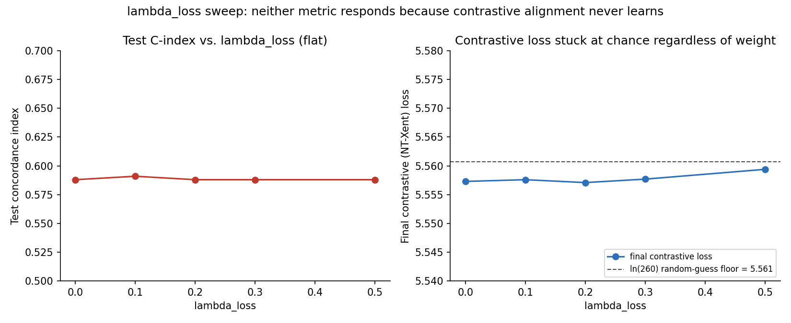

**Diagnosis, not just a negative result**: the contrastive loss sat at
5.557-5.564 in *every* run, at epoch 1 and epoch 200 alike -- and
`ln(260) = 5.561` is exactly the loss a 260-way classifier gets from pure
random guessing. The contrastive alignment objective never learns
anything in this setup, regardless of how much weight it's given, which
is exactly why lambda doesn't move the test C-index at all. Plausible
reason: in the paper, radiomics tokens come from the *same pixel patches*
the image ViT processes, giving a direct spatial correspondence; here the
image branch is a whole-crop global DINOv3 embedding while the radiomics
branch aggregates patch-level classical stats through a separately
pretrained transformer -- there's no guarantee these two summarize
enough shared, case-identifying information for a 260-way matching task
to be solvable at this scale, with no augmentation or hard-negative
mining.

## Task 5 -- Pretraining corpus #2: domain-matched NPC MRI

Swapped LUNA16 for a **domain-matched external dataset**: 277 primary NPC
patients, T1-weighted MRI with tumor segmentation masks (Zenodo
10.5281/zenodo.13131827) -- same disease, same anatomy, same sequence as
our own cohort. Reused the exact tumor-mask ROI-crop logic already
validated on our own data, instead of LUNA16's nodule-center
approximation. 276/277 patients (99.6%) yielded a usable crop.

A disk crisis happened mid-download: extracting the 4.9GB zip produced
24GB of raw DICOM, pushing free space to 7.8GB on a 939GB disk (100%
used). Handled the same way as LUNA16: tokenize immediately, delete the
raw files right after.

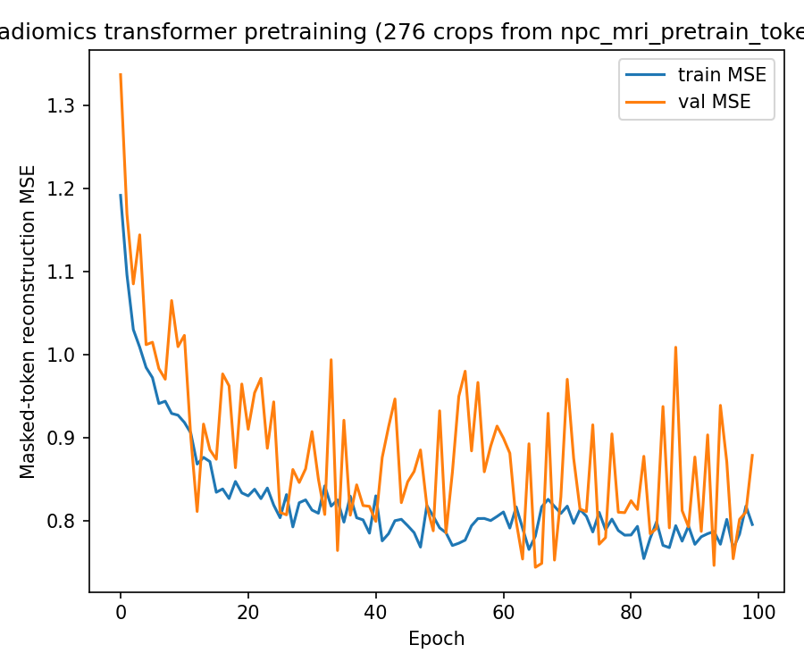

Notable: only **16 features** survived the zero-variance filter on this
corpus (vs. 93 for LUNA16) -- and 16 is exactly what our own NPC cohort's
radiomics tokens independently reduce to, a sign the domain match is real
at the feature level, not just thematic.

**Single-split smoke test: 0.632** (vs. 0.588 for LUNA16) -- looked like a
clear win.

## Task 6 -- Nested-CV validation (NPC-MRI pretrain) -- the twist

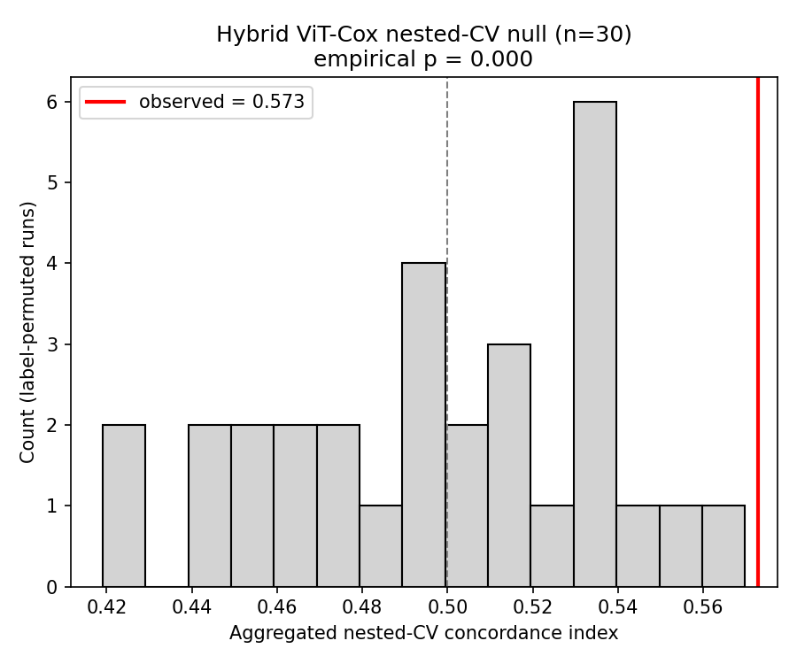

**Result: C-index 0.573, null mean 0.497 +/- 0.039, p=0.000** -- still
significant, but *lower* than LUNA16's 0.609, reversing what the
single-split check suggested. Same lesson this whole session keeps
teaching: a single train/valid/test split isn't reliable for comparing
two configurations, even when the difference looks large and the
intuition (matched domain should transfer better) is completely
reasonable. Best guess why: fewer pretraining examples (276 vs. 368) and,
more likely, far fewer features to reconstruct during masked-token
pretraining (16 vs. 93) gives the model much less signal to learn from,
even though the 16 that exist are more relevant.

## Task 7 -- Fixing the contrastive loss (temperature)

The flat contrastive loss diagnosed in Task 4 turned out to have a
specific, fixable cause: `temperature=0.5` (paper default) was too high,
washing out whatever weak cosine-similarity structure existed between
the L2-normalized projections into a near-uniform softmax. Swept
temperature in {0.5, 0.2, 0.1, 0.07, 0.03, 0.01} on the fast single-split
check (NPC-MRI-pretrained encoder): `temperature=0.1` gave the best
single-split result (**0.682**, the best of the whole project) *and*,
critically, a genuinely decreasing contrastive loss during training
(5.66 -> 5.27 -> 4.36 over 40 epochs, confirmed well clear of the 5.561
random-guessing floor) -- the fix mechanically works. Interestingly, the
same fix barely helps the LUNA16-pretrained encoder (loss only reaches
5.565 by epoch 40 at the same temperature) -- the domain-matched
embedding space apparently gives the contrastive objective more
exploitable structure to latch onto in the first place.

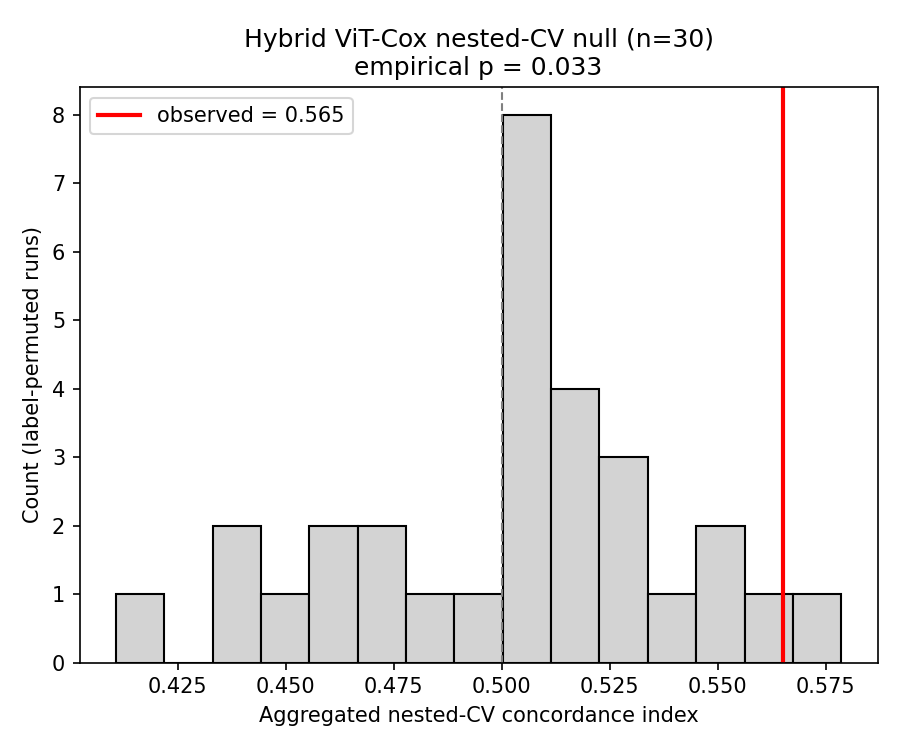

Validated with the full nested-CV protocol: **C-index 0.565, p=0.033**.
This is the **fourth** time this session a single-split "improvement" has
evaporated under nested CV (after the metastasis event/time-column bug,
the both-mode single-split jump, and the NPC-MRI-vs-LUNA16 pretraining
comparison). Worse, it's not just "no improvement" -- 0.565 is the lowest
nested-CV C-index of any hybrid configuration tried, and p=0.033 is the
weakest (and only marginal) significance result among everything reported
as "significant" in this project; every other one was p=0.000, comfortably
clear of its null. Successfully teaching the contrastive objective to
learn cross-modal alignment did not translate into better survival
prediction -- plausibly because "structure two embeddings share" and
"structure useful for predicting this specific outcome" aren't the same
thing, and forcing alignment can pull each branch away from what it was
independently good at.

## Task 8 -- Sweeping alpha (mixed-risk weighting)

Only `alpha=0.5` (paper default) had been tried. Given radiomics has
shown no independent signal in every check this session, swept alpha in
{0.0, 0.1, ..., 1.0} on the fast single-split check (LUNA16-pretrained
encoder, default lambda/temperature). Result was a clean, near-monotonic
trend -- not a single lucky spot-check: test C-index rose from 0.368 at
alpha=1.0 (pure radiomics risk) to 0.608 at alpha=0.0 (pure image risk in
the mix formula; the radiomics branch still trains via the contrastive
loss, which doesn't depend on alpha).

Validated the extreme (alpha=0.0) with the full nested-CV protocol:
**C-index 0.612, null mean 0.504 +/- 0.031, p=0.000** -- clean separation,
and the **best hybrid-model result of the whole project**. The gain over
alpha=0.5's 0.609 is real but modest (+0.003); both are comfortably
significant. Even at alpha=0.0 this configuration isn't identical to the
linear-head study's plain `image`-only model -- the radiomics branch's
contrastive-loss gradient still pushes on the image projection head even
though radiomics never enters the risk formula -- and that extra pressure
still doesn't close the gap: 0.612 remains below 0.643.

## Task 9 -- Swapping the image backbone: Merlin (3D CT foundation model)

The linear-head study's Merlin port (see `resume/linear_head/` Task 11)
asked whether a 3D CT foundation model on the whole volume beats DINOv3's
tumor-cropped slice. Same question here for the hybrid: `src/ViT_cox_Merlin/`
reuses this entire architecture unchanged and only swaps the image branch
from DINOv3's 384-d CLS token to **Merlin's 2048-d whole-volume
embedding** (the exact cache from the linear Merlin study). The radiomics
shallow transformer, LUNA16 pretraining, fusion, and contrastive loss are
identical and reused verbatim -- image `cache_file` + `embed_dim` are the
only lines that change, via `config/vit_cox_merlin_config.yaml`. Ran in the
`MERLIN` env.

Validated with the same nested-CV protocol as every hybrid number above
(5x5-fold, 30-permutation null), at the paper-default alpha=0.5 and at
alpha=0.0 (the pure-image-in-the-mix setting that was best for DINOv3):

| hybrid, image branch | alpha | nested-CV C | p |
|---|---|---|---|
| DINOv3 (best hybrid) | 0.0 | 0.612 | 0.000 |
| DINOv3 | 0.5 | 0.609 | 0.000 |
| **Merlin** | **0.5** | **0.512** | 0.43 |
| **Merlin** | **0.0** | **0.511** | 0.47 |

| Merlin hybrid, alpha=0.5 | Merlin hybrid, alpha=0.0 |
|---|---|
| 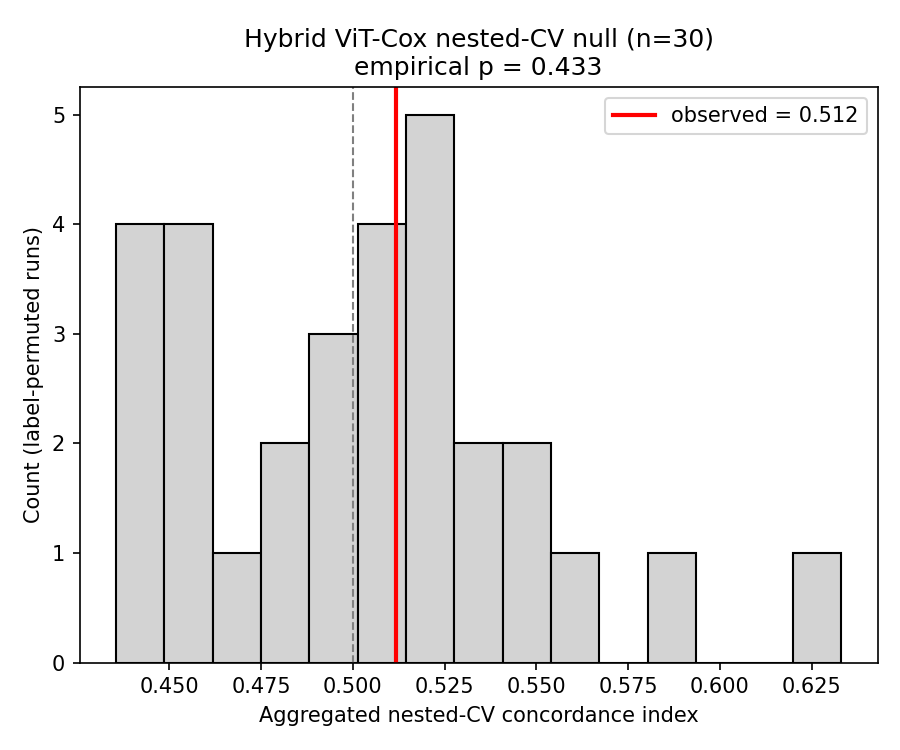 | 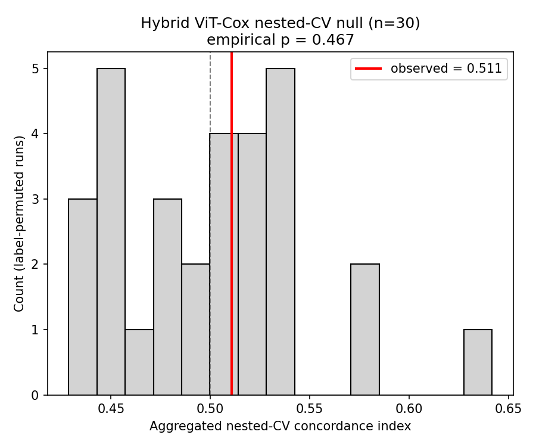 |

**Both land at chance (0.51, p~0.45), inside the null band** -- and this is
exactly what the linear-head Merlin result predicted. The hybrid's image
branch *is* the same whole-volume Merlin embedding that scored 0.489
(chance) on its own; fusing a chance-level image branch with the
no-signal radiomics branch can't manufacture a signal, so alpha barely
matters (0.512 vs 0.511). This isn't a hybrid-architecture failure -- the
DINOv3 hybrid works because its image branch carries a real 0.643 signal
to begin with. The whole-volume Merlin embedding doesn't, so nothing
downstream can recover it.

The likely culprit, same as the linear study: DINOv3 is fed a
**tumor-cropped** input while Merlin pools the entire head-and-neck volume
into one global vector with no tumor localization (and was pretrained on
abdominal CT).

### Follow-up: ROI-cropped Merlin image branch

Ran the localization fix here too -- the image branch now uses the
**tumor-ROI-cropped** Merlin embeddings (`config/vit_cox_merlin_roi_config.yaml`,
same 3D-bbox-crop-then-resize as the linear study), radiomics branch still
LUNA16-pretrained, same nested-CV protocol:

| hybrid, Merlin image branch | alpha | whole-volume | **ROI crop** | ROI p |
|---|---|---|---|---|
| Merlin | 0.5 | 0.512 | **0.510** | 0.30 |
| Merlin | 0.0 | 0.511 | **0.484** | 0.67 |

| Merlin ROI hybrid, alpha=0.5 | Merlin ROI hybrid, alpha=0.0 |
|---|---|
| 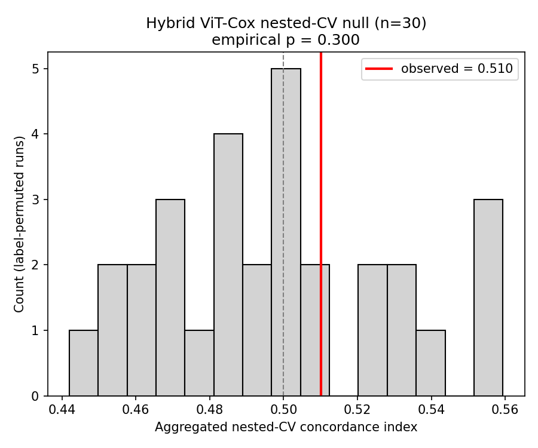 | 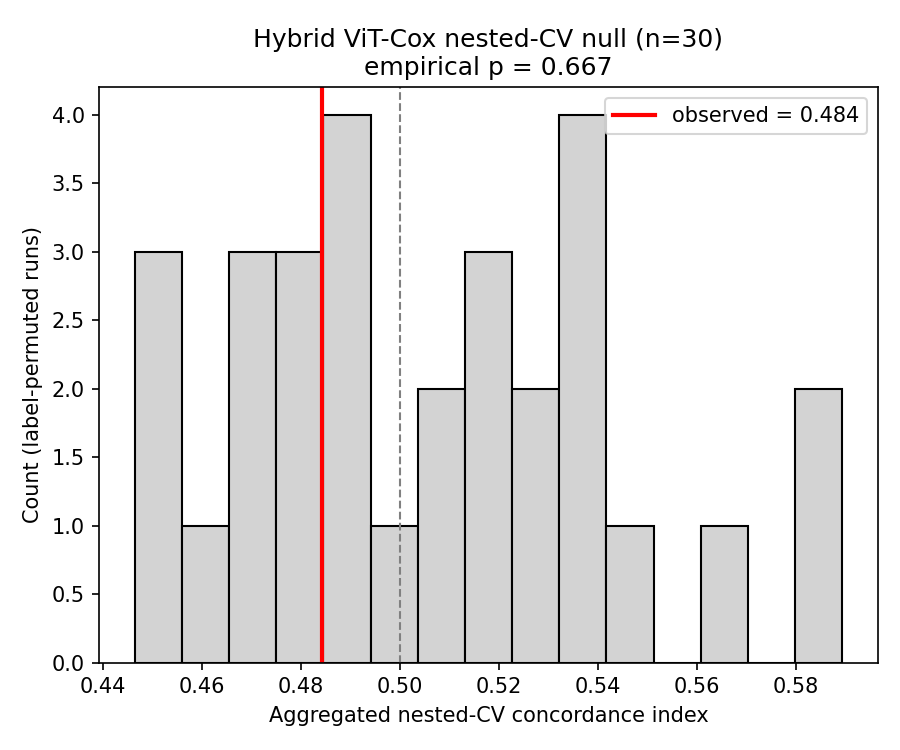 |

The hybrid **stays at chance** (0.51 / 0.48). Consistent with the linear
study, where the same ROI crop lifted the Merlin image branch only from
0.489 to 0.528 -- still short of significance -- so there's no real signal
for the hybrid to inherit. The ~0.04 lift the linear head saw from the ROI
crop doesn't survive into the noisier 30-permutation hybrid evaluation.
Confirms the diagnosis: the ceiling here is the Merlin image
representation, not the fusion; localization helps a little but the
whole-volume avgpool embedding simply doesn't carry this signal.

## Bottom line -- everything validated this session, side by side

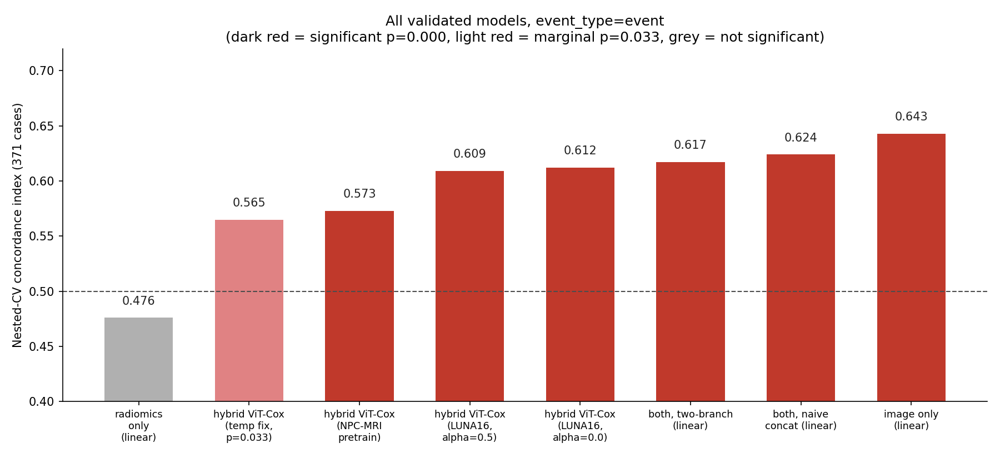

| model | nested C-index | p |
|---|---|---|
| linear head, image only | **0.643** | 0.000 |
| linear head, both (naive concat) | 0.624 | 0.000 |
| linear head, both (two-branch fix) | 0.617 | 0.000 |
| hybrid ViT-Cox, LUNA16 pretrain, alpha=0.0 | 0.612 | 0.000 |
| hybrid ViT-Cox, LUNA16 pretrain, alpha=0.5 | 0.609 | 0.000 |
| hybrid ViT-Cox, NPC-MRI pretrain | 0.573 | 0.000 |
| hybrid ViT-Cox, NPC-MRI pretrain + temperature fix | 0.565 | 0.033 (marginal) |
| hybrid ViT-Cox, **Merlin** (whole-vol) image branch, alpha=0.5 | 0.512 | not significant |
| hybrid ViT-Cox, **Merlin** (whole-vol) image branch, alpha=0.0 | 0.511 | not significant |
| hybrid ViT-Cox, **Merlin** (ROI-crop) image branch, alpha=0.5 | 0.510 | not significant |
| hybrid ViT-Cox, **Merlin** (ROI-crop) image branch, alpha=0.0 | 0.484 | not significant |
| linear head, Merlin image only (whole volume) | 0.489 | not significant |
| linear head, Merlin image only (ROI crop) | 0.528 | not significant |
| linear head, radiomics only | 0.476 | not significant |

- The simplest approach (one linear layer on the frozen DINOv3 CLS token)
  is still the best-validated model overall, by a clear margin. Every
  attempt to add radiomics -- naive concatenation, a regularized
  two-branch head, or the full paper architecture under any pretraining
  corpus, loss weighting, or temperature tried -- has come in lower.
- The consistent pattern across the whole session: the closer a
  configuration gets to "effectively just using the image signal," the
  better it does. Radiomics adds no value for this outcome on this
  cohort, in any combination scheme tried so far.
- The hybrid architecture faithfully reproduces the paper and shows a
  real effect in most configurations; it just hasn't yet earned its
  added complexity over the linear head for this outcome, on this cohort.
- "Fixing" a diagnosed problem (the flat contrastive loss) is not the
  same as improving the model -- worth remembering before chasing the
  next mechanistic fix without checking it against the full validation
  protocol first.
- Swapping the image branch from DINOv3 to the **Merlin** 3D CT foundation
  model collapses the hybrid to chance (0.51, p~0.45) -- because that
  branch is the same Merlin embedding that scores 0.489 (chance) alone.
  Cropping Merlin to the tumor ROI (like DINOv3) helps the linear image
  branch a little (0.489 -> 0.528) but not the hybrid (still ~0.50), and
  never reaches significance. The hybrid only ever worked by carrying a
  real image signal; it can't create one. Backbone choice and ROI
  presentation matter far more than the fusion machinery.
- No lockbox test set exists yet for either study -- every reported
  number here is internal nested-CV validation on the same 371-case
  cohort, not a held-out final result.
