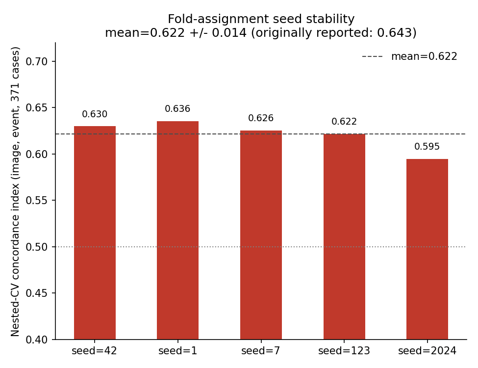

# Seed stability check -- event_type=event, image mode

## Why

Two results this session looked real on a single evaluation and turned out
to be mostly noise once checked more rigorously (the metastasis time-column
bug, the both-mode single-split "improvement"). Before fully trusting the
flagship `event`/`image` nested-CV result (0.643, p=0.000), checked
whether it depends on which particular fold assignment (`--seed`) the
5x5-fold outer CV happened to draw.

## Method

Reran the real (non-permuted) nested-CV pass for `event_type=event`,
`input_mode=image`, 5 repeats x 5-fold, across 5 different seeds (42, 1, 7,
123, 2024) -- only the observed aggregated C-index, no null permutations
rerun (this checks fold-assignment stability specifically, not
significance, which was already established).

## Results

| seed | C-index |
|---|---|
| 42 | 0.630 |
| 1 | 0.636 |
| 7 | 0.626 |
| 123 | 0.622 |
| 2024 | 0.595 |

mean = 0.622, std = 0.014, range [0.595, 0.636].

## Interpretation

Tight spread (std=0.014) relative to the effect size itself (~0.12 above
chance) -- the signal is not an artifact of one lucky fold assignment. The
originally reported 0.643 (a slightly different run of the pipeline, same
seed=42 but a different exact sequence of random calls before it, which
shifts linear-layer weight initialization) sits right at the top of this
band, consistent with -- not an outlier from -- the other seeds. Unlike the
metastasis bug and the both-mode single-split jump, this result holds up
under a stability re-check.
